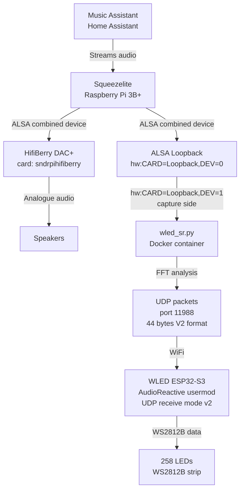
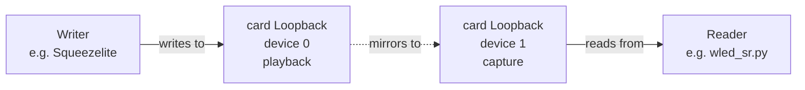
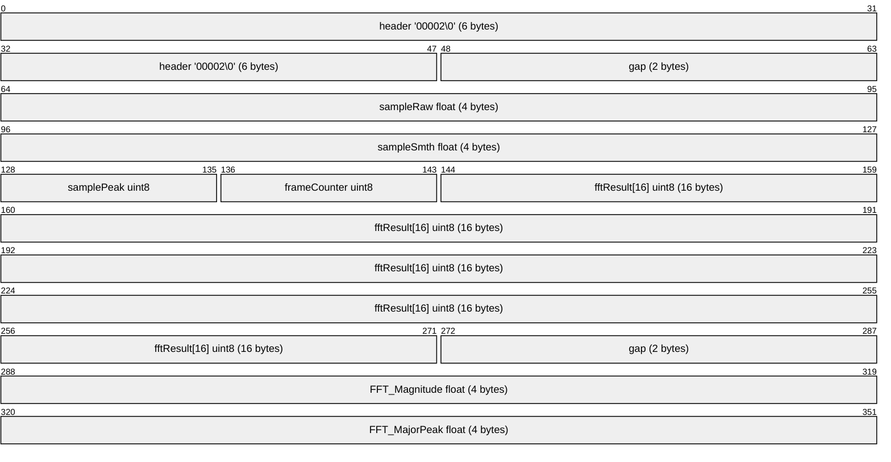
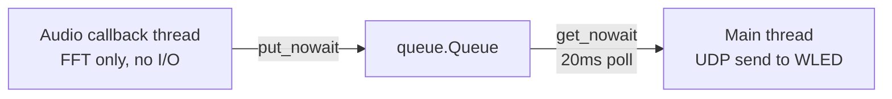
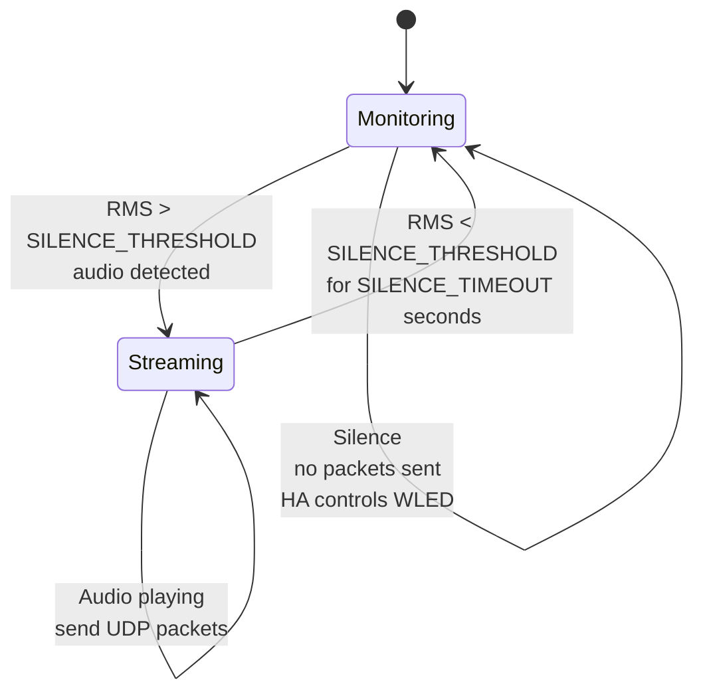
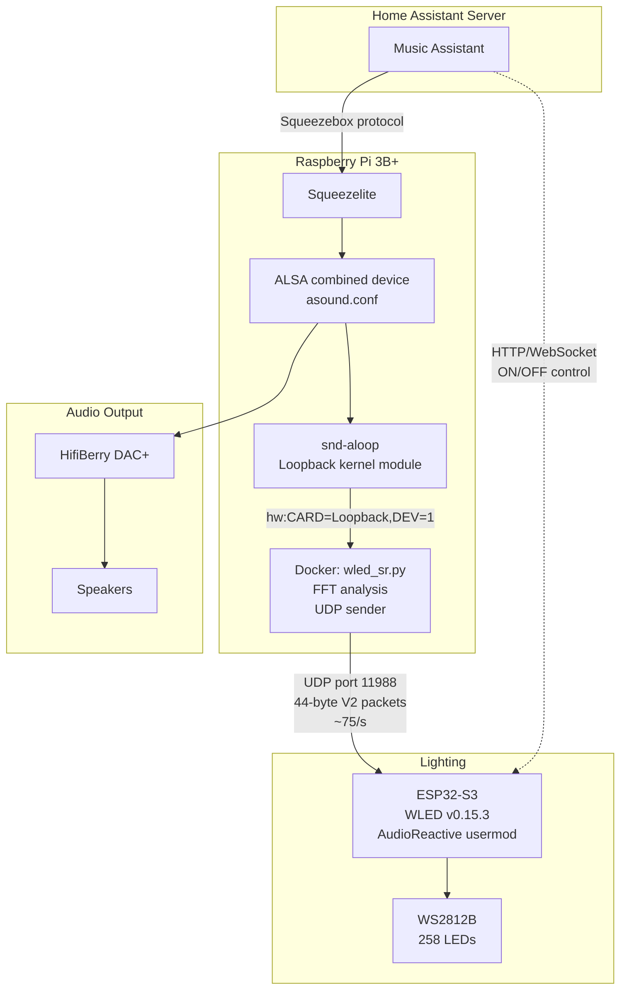

*How I wired Home Assistant, Music Assistant, a Raspberry Pi, and a WLED ESP32-S3 together to get audio-reactive lights driven entirely from the music stream — no microphone required.*
---
(Claude helped with both the project and this post)

## The Goal

I wanted my WLED-controlled lights to react to whatever was playing through my HiFi system — pulsing, flashing, and shifting colours in time with the music. The catch: I didn't want a microphone picking up room noise, and I wanted it to work automatically whenever music played, without any manual intervention.

---

## The Stack

Before diving in, here's what the final working system looks like end-to-end:



---

## Hardware

| Component | Model | Notes |
|---|---|---|
| Single board computer | Raspberry Pi 3B+ | Runs Squeezelite + Docker |
| DAC | HifiBerry DAC+ | Outputs to speakers via ALSA |
| LED controller (original) | Wemos D1 Mini (ESP8266) | Too underpowered for AudioReactive |
| LED controller (final) | Lolin S3 Mini (ESP32-S3FH4R2) | 4MB flash, 2MB PSRAM, dual core |
| LED strip | WS2812B, 258 LEDs | Data pin GPIO2 |

### 💡 Lesson Learned: ESP8266 Won't Cut It

The original D1 Mini (ESP8266) had only **17KB of free heap** at runtime — nowhere near enough to process incoming UDP audio sync packets alongside driving 258 LEDs at 42fps. The AudioReactive usermod is **ESP32 only**.

When choosing an ESP32 board for WLED AudioReactive, avoid the ESP32-S2 (single core). The **ESP32-S3** is the sweet spot — dual core at 240MHz, hardware floating point, and PSRAM support. The Lolin S3 Mini delivered **214KB free heap** and **1963KB free PSRAM** — a night-and-day difference.

---

## Software

| Component | Software | Notes |
|---|---|---|
| Smart home | Home Assistant | Orchestrates everything |
| Music player backend | Music Assistant | Replaces LMS |
| Squeezebox client | Squeezelite | Plays audio on the Pi |
| LED firmware | WLED v0.15.3 "Kōsen" | With AudioReactive usermod |
| Audio tap | wled_sr.py | Custom Python script in Docker |

---

## Step 1: Tapping the Audio Stream with ALSA Loopback

The Pi runs Squeezelite pointed directly at the HifiBerry DAC via ALSA. To intercept the audio without a microphone — and without interrupting playback — we used the **ALSA loopback kernel module** combined with a **multi device** in `asound.conf`.

### Load the loopback module

```bash
sudo modprobe snd-aloop

# Make it persist across reboots
echo "snd-aloop" | sudo tee /etc/modules-load.d/snd-aloop.conf
```

### Configure ALSA to mirror audio to both DAC and loopback

`/etc/asound.conf`:

```
pcm.multi {
    type multi
    slaves {
        a { pcm "hw:CARD=sndrpihifiberry,DEV=0" channels 2 }
        b { pcm "hw:CARD=Loopback,DEV=0" channels 2 }
    }
    bindings {
        0 { slave a channel 0 }
        1 { slave a channel 1 }
        2 { slave b channel 0 }
        3 { slave b channel 1 }
    }
}

pcm.combined {
    type route
    slave.pcm "multi"
    slave.channels 4
    ttable {
        0.0 1
        1.1 1
        0.2 1
        1.3 1
    }
}

ctl.combined {
    type hw
    card sndrpihifiberry
}
```

### Point Squeezelite at the combined device

`/etc/default/squeezelite`:

```
SL_SOUNDCARD="combined"
```

### 💡 Lesson Learned: Use Card Names, Not Numbers

Initially we used `hw:1,0` and `hw:3,0` in `asound.conf`. After a reboot, the kernel loaded modules in a different order and card numbers shuffled — breaking everything silently. Always use `hw:CARD=sndrpihifiberry,DEV=0` and `hw:CARD=Loopback,DEV=0` so the config survives reboots regardless of card numbering.

### 💡 Lesson Learned: The Loopback Mirror Pairing

The ALSA loopback has two devices (0 and 1) that mirror each other:



Write to device 0 playback → read from device 1 capture. This is `hw:CARD=Loopback,DEV=1` for the reader. Only **one process can hold a capture subdevice open at a time** — if something else has it open, your reader gets silence.

---

## Step 2: Flashing WLED with AudioReactive

### 💡 Lesson Learned: AudioReactive is a Usermod — Check Your Build

WLED's stock builds from install.wled.me do **not** always include the AudioReactive usermod. To verify:

```bash
curl http://<wled-ip>/json/info | python3 -m json.tool | grep -A5 AudioReactive
```

If you don't see an `AudioReactive` key, reflash with a build that includes it. For ESP32-S3 we used [wled-install.github.io](https://wled-install.github.io) and selected:

> **ESP32-S3 (4MB Flash, with Audio reactive Usermod)**

For flashing without a working web serial connection, the **Jason2866 ESP_Flasher** ([github.com/Jason2866/ESP_Flasher](https://github.com/Jason2866/ESP_Flasher)) is a reliable standalone GUI tool. Note: ESPHome Flasher is archived and no longer maintained.

### Configure AudioReactive in WLED

1. Enable AudioReactive via the info page toggle or API:
```bash
curl -X POST http://<wled-ip>/json \
  -H "Content-Type: application/json" \
  -d '{"AudioReactive":{"enabled":true}}'
```

2. Go to **Config → AudioReactive** and set:
   - **Audio Source**: UDP Sound Sync
   - **UDP Sync mode**: Receive

3. Select an AudioReactive effect (look for the 🎵 icon) — Freqmap, Blurz, or DJ Lights are good starting points.

When working correctly, the info page shows:

```
Audio Source:    UDP sound sync - receiving
Sound Processing: suspended
UDP Sound Sync:  receive mode v2
```

> "Sound Processing: suspended" is **correct** — it means the local DSP is suspended in favour of incoming UDP data.

---

## Step 3: The Audio Analysis Script

The custom Python script `wled_sr.py` runs in a Docker container on the Pi. It:

1. Captures audio from the ALSA loopback
2. Computes an FFT with mel-spaced frequency bands
3. Sends the result to WLED as a **V2 UDP audio sync packet**

### 💡 Lesson Learned: The V2 Packet Format Matters

This was the hardest bug to track down. WLED AudioReactive expects a specific 44-byte packet with header `"00002\0"` — not the `"WLED"` header used by older WLED-SR forks. The full structure:



Sending the wrong packet format causes WLED to silently stay in `idle` state — packets arrive but are discarded.

### 💡 Lesson Learned: Never Do I/O in the Audio Callback

The audio callback runs on a real-time thread. Any blocking operation — including HTTP requests or even slow Python code — causes **input overflow**, where the audio buffer fills up faster than it's being consumed. The result is audio glitches and corrupted data.

The solution: the callback does **only** CPU work (FFT), then signals via a `queue.Queue`. All network I/O happens on the main thread.



### Docker setup

The script runs in Docker to keep all dependencies isolated from the Pi's OS:

```dockerfile
FROM python:3.12-slim AS builder
RUN apt-get update && apt-get install -y --no-install-recommends gcc
RUN pip install --no-cache-dir --prefix=/install sounddevice numpy requests

FROM python:3.12-slim
RUN apt-get update && apt-get install -y --no-install-recommends \
    libasound2 libportaudio2
COPY --from=builder /install /usr/local
COPY wled_sr.py .
ENTRYPOINT ["python3", "wled_sr.py"]
```

Run command (using card name for reboot resilience):

```bash
docker run -d --name wled-sr \
  --device /dev/snd \
  --restart unless-stopped \
  wled-sr \
  --wled 192.168.1.195 \
  --device hw:CARD=Loopback,DEV=1
```

---

## Step 4: Silence Detection — Playing Nicely with Home Assistant

Without silence detection, the script continuously sends UDP packets even when nothing is playing. WLED interprets near-zero packets as "on" and turns itself back on after Home Assistant turns it off.

The fix: track RMS energy and stop streaming after `SILENCE_TIMEOUT` seconds of silence. WLED then returns to HA control.



---

## The Scripts

Both scripts are available as GitHub Gists:

- **`wled_sr.py`** — UDP audio sync sender for WLED AudioReactive (ESP32 with SR firmware): [gist.github.com/endemics/9663bf76fe618b81445f16fe09310b3b](https://gist.github.com/endemics/9663bf76fe618b81445f16fe09310b3b)
- **`wled_beat.py`** — HTTP beat detection for stock WLED (works on ESP8266 too): [gist.github.com/endemics/e9a66fbffe827cdb357093a8ecf0fd07](https://gist.github.com/endemics/e9a66fbffe827cdb357093a8ecf0fd07)

---

## Troubleshooting Reference

| Symptom | Likely Cause | Fix |
|---|---|---|
| `No input device matching 'hw:X,Y'` | snd-aloop not loaded or card numbers shuffled | `modprobe snd-aloop`, use card names |
| Audio levels all zero | Another process holds the capture device | `ps aux \| grep wled`, kill stale process |
| `input overflow` warnings | I/O in audio callback | Move network calls off callback thread |
| WLED shows `UDP sound sync - idle` | Wrong packet format or no packets arriving | Check header is `"00002\0"`, verify with tcpdump |
| WLED shows `UDP sound sync - receiving` but no effect | Non-AudioReactive effect selected | Pick an effect with 🎵 icon |
| WLED turns itself back on after HA turns it off | Script sending packets during silence | Enable silence detection / SILENCE_TIMEOUT |
| ESP8266 UDP sync not working | Not enough free heap (17KB) | Upgrade to ESP32-S3 |
| BPM double what's expected | Beat cooldown too short | Increase `BEAT_COOLDOWN` to 0.3s+ |

---

## Final Architecture



---

*Total LEDs: 258 × WS2812B — Average FPS: 43 — Free heap: 214KB — Free PSRAM: 1963KB*